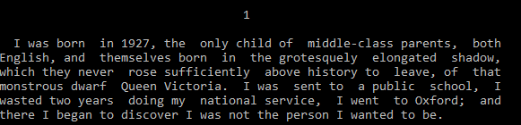

# fb2text
A library to convert FB2 book to text file. Demo includes a ready to use very simple converter that gets a raw FB2 file or zipped FB2 and makes a text file with defined text width. The conversion result can be saved to file or printed to terminal

## Library Functions
### IsZipFile(filePath string) bool
Retunrs if the file is zipped FB2 or raw xml one.
There is no check if the file is valid FB2, so if filePath points to a file that is neither FB2 nor archive, the function returns false

### Justify(s string, maxWidth int) string
Expands a string to a width maxWidth by adding extra spaces between words.
If the string is longer than maxWidth or does not contain space then the
function return original string.

Examples:
*  Justify("a b c", 7)  ==> "a  b  c"
*  Justify("a b c d", 8) ==> "a b  c d"
*  Justify("abcde", 10) ==> "abcde"

### ParseBook(fileName string, parseBody bool) (BookInfo, []string)
Reads FB2 file(zipped FB2 is unpacked automatically) and converts it into internal format. Please see more about internal format in function description.

* parseBody - defines if the caller wants only information about book or book information and the whole converted text. Setting parseBody to false can speed up book parsing if you need only information about book since the information is always in the beginning of FB2

Returns:
* BookInfo - information about book (only the most important one like title, author, and sequence)
* []string - parsed book text in internal format. Please description of function ParseBook in source file for details

### FormatBook(parsed []string, maxWidth int, justify bool) []string
The default formatter. The function gets parsed book in internal format and returns a regular text with each string limited to maxWidth width.

* parsed - text in internal format. Please see the function ParseBook for details
* maxWidth - no line of text exceeds this limit
* justify - add extra spaces between words to make all lines, except the last line of each paragraph, the same width
Compare the same text with
justify = false


justify = true


# A Demo Application
A  is a simple converter FB2 to txt. It saves the result to a file or prints the text to terminal if output file is not set.

Usage:
```
   fb2text [-w N] [-j=0/1] inputFile [outputFile]
```

Program arguments:
* -w N - limit the maximum width of a text line to N. N is a number between 30 and 400. The default value is 70
* -j=0/1 - disable or enable expanding extra spaces to lines to make all of them the same width. Please see description of function FormatBook for examples. Default value is 0 - disable justification
* inputFile - the only required parameter - FB2 file to convert. It can be either raw FB2 or zipped one, zipped FB2 is detected and unpacked automatically
* outputFile - file name to save the result. If output filename is omitted than the converter just prints the converted text to terminal(stdout)
